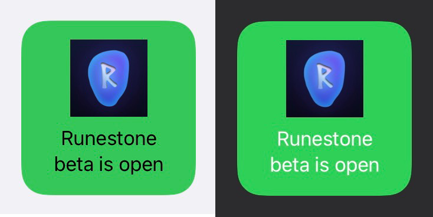
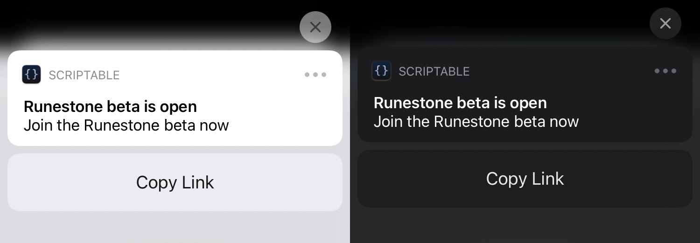
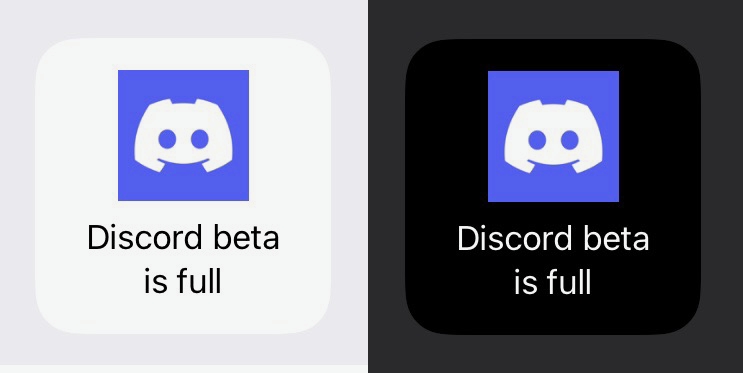
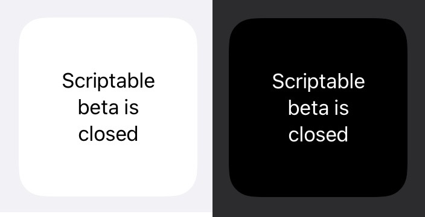

# TestFlight Watcher

A [Scriptable](https://scriptable.app) widget to watch for openings in [TestFlight](https://testflight.apple.com/) betas and notify you when a spot is available.

This script is intended to be used as a widget on your home screen. You may also set up [automations in Shortcuts](https://support.apple.com/guide/shortcuts/create-a-new-personal-automation-apdfbdbd7123) to run this script, to check for TestFlight openings at times other than the ones dictated by Scriptable's normal widget refresh interval.

## Installation

[Click here](https://fifithebulldog.github.io/scriptable-testflight-watcher/TestFlight%20Watcher.scriptable) to download TestFlight Watcher.

The source code is [here](./TestFlight%20Watcher.js).

## Specifying a beta

### In the script

Specify the default TestFlight ID or URL (either works) and the app name in the `prefs` object, which begin on line 49 in the script. These will be overridden if the TestFlight link and app name are supplied as a widget parameter or shortcut arguments.

The values you can customize are:

- `testFlight`: TestFlight ID or URL
- `appName`: name of TestFlight app
- `notify`: whether to send a notification when there is an open beta spot. Defaults to true unless explicitly set to false.
- `sound`: whether the notification for an open beta spot should have a sound. Defaults to false.

The default `prefs` object looks like this:

```js
const prefs = {
  testFlight: "uN1vTqxk",
  appName: "Scriptable",
  notify: true,
  sound: false
};
```

You can also use a dictionary of the same form as the shortcut parameter when running this script from a shortcut.

### From a widget

To specify the app name and TestFlight link as a widget parameter, use the following syntax in the widget configurator's "Parameter" field:

    TESTFLIGHT_ID|APP_NAME

where the TestFlight ID/link and app name are separated by a vertical bar (`|`).

For example:

    uN1vTqxk|Scriptable

specifies the Scriptable beta.

### From a shortcut

As mentioned above, you can also pass in arguments from a shortcut, using the Run Script action. There are three ways to do this:

- Use a dictionary with the same format as `prefs` as the shortcut parameter (recommended)
- Set the app name to be the first item in the Texts field, and set the TestFlight ID or URL as the first item in the URLs field
- Set the TestFlight ID or URL as the first item in the Texts field, and set the app name as the second item in the Texts field (similar to the order used for widget parameters)

Happy TestFlight sniping!

## Screenshots




